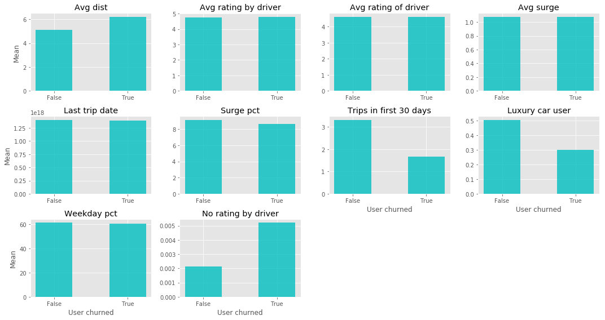
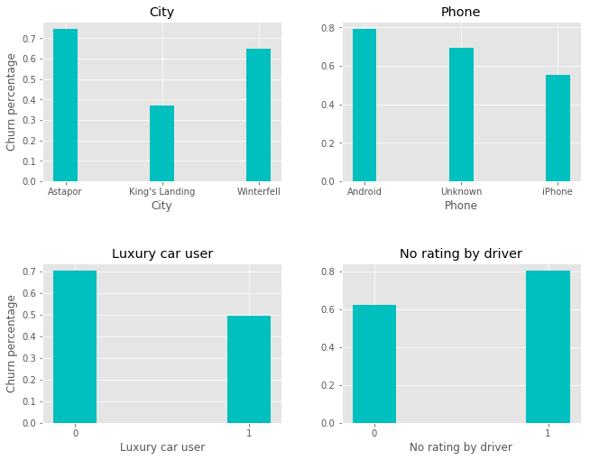
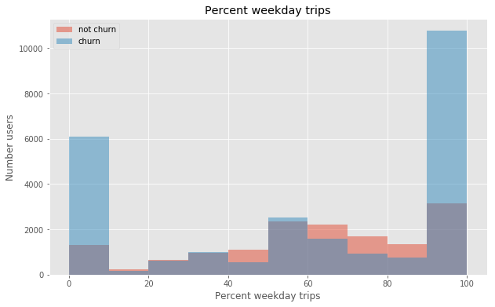
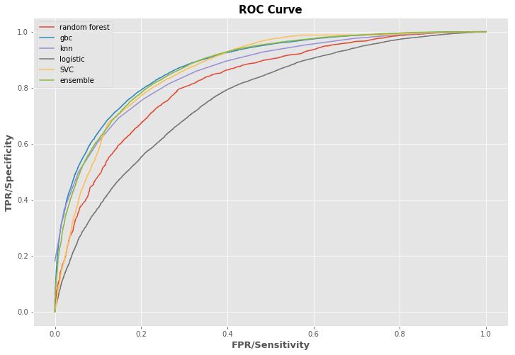
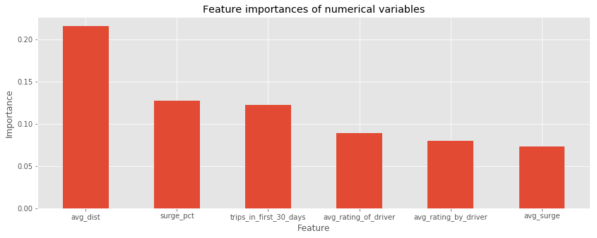
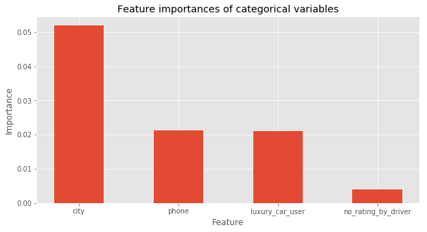

# Predicting churn for a ride-sharing company
Company X, a ride-sharing company, is interested in predicting rider retention. In order to determine whether a user would churn, a sample dataset of users who signed up for an account during January 2014 was used in order to model rider behavior. Data was pulled on July 1, 2014.

This project was performed in collaboration with mhichar and benedictaquino.

## About the data
Users were considered 'active' if they had taken a trip in the 30 days prior to data extraction (July 1).

As data is proprietary, it has not been included in this repository.

The goal of this analysis was the understand which factors are the suitable predictors for retaining users and produce suggestions for retaining users.

Below is an example of the information included in this dataset:

```
city: city this user signed up in
phone: primary device for this user
signup_date: date of account registration; in the form `YYYYMMDD`
last_trip_date: the last time this user completed a trip; in the form `YYYYMMDD`
avg_dist: the average distance (in miles) per trip taken in the first 30 days after signup
avg_rating_by_driver: the rider’s average rating over all of their trips
avg_rating_of_driver: the rider’s average rating of their drivers over all of their trips
surge_pct: the percent of trips taken with surge multiplier > 1
avg_surge: The average surge multiplier over all of this user’s trips
trips_in_first_30_days: the number of trips this user took in the first 30 days after signing up
luxury_car_user: TRUE if the user took a luxury car in their first 30 days; FALSE otherwise
weekday_pct: the percent of the user’s trips occurring during a weekday
```

## Process
Data analysis and workflow is detailed in a jupyter notebook entitled `ride-share.ipynb`. A summarized version is provided below:

### Data cleaning
As drivers and users who did not have ratings may be a factor in retention, I engineered new boolean features to capture whether the trip consisted of a driver or user being rated. Categorical variables such as city and phone were transformed into binary dummy variables.

To create a target label, churn was defined as whether the last trip taken was before 30 days since the data was extracted (June 1, 2014).

### Data analysis
About 62% of our users have churned since January.

Plotting our numerical variables by churn, we can see some preliminary obvious differences in average distance, number of trips within the past 30 days, luxury care usage, and whether users were rated by the driver.



In plotting these multi-category variables we can differences between cities, android and iphone users, luxury car users, and unrated versus rated users.



Plotting the percentage of weekday trips a user had shows large spikes of users in the churned population. While we do not have information on the total number of trips for each user, we can speculate that users may be taking single or a low number of occasional trips (eg, to the airport for travel).



### Model testing and evaluation
I tested a series of classifier model to predict churn, including logistic regression, random forest, k-nearest neighbors, gradient boosting, support vector machine, and ensemble model.

I used a series of metrics to evaluate these models, including accuracy, precision, recall, and F1 score.

Each model was initially used out of the box and then iteratively evaluated using a grid search of hyperparameters with 5-fold cross validation.

### Model evaluation
The predicted probabilities, false positive rate (FPR), and true positive rate (TPR) were calculated for each model in order to compare and evaluate model performance. The gradient boosted model performed with superior




### Interpretation
As the gradient boosting model gave the superior performance of the models tested, I examined sklearn's feature importances method to determine the top variables attributing that may attribute to predicting churn. As numerical variables typically have higher feature importances compared to categorical variables, variables were only compared within these groups.

For numerical variables, the average distance, percentage of time that a user experienced surge, and the number of trips a user took in their first 30 days were listed as the top predictors for retention. Users who had shorter average distances and fewer numbers of trips had increased churn. Unexpectedly, those who churned has slightly smaller differences percentages in churn. This may be due to the high number of one-time use cases for users who churned that never experienced surge pricing.



For categorical variables, city location, phone type, and luxury car usage were more significant. Combined with our preliminary data analysis, we can see that Astapor, Android users, and non-luxury car users show greater churn.



### Conclusions
Based on this analysis and modeling exercise, I suggest several actions that Company X can take in order to reduce churn:

 - **Focus on users in Astapor:** While the actual city names of this dataset have been redacted, there are clear differences in percentage of churn between locations. At 74.5% of users churned, Astapor has the highest churn rate, compared to 37.2 for King's Landing.
 - **Spend engineering or UX resources on Android app:** As users with Android phone have higher churn rates, the android app may have provide a different user experience compared to the iPhone app. Investigation of user experience with the Android app may be warrented if there are significant differences between mobile phone versions. Additionally, this difference may be correlated with differences in user socioeconomic characteristics as Iphone are more expensive.
 - **Non-luxury car satisfaction:** Luxury cars users showed lower rates of churn compared to non-luxury car users. While this may be due to socioeconomic differences between users, economy car trips may also be inferior service that is affecting user experience. Ensuring consistent driver habits and service across vehicles may be investigated as a way to improve user retention
 - **Promote new users:** As trips taken in the first month of sign up has an effect on retention, focusing on keeping new users engaged in the service may help establish habits that help users continue to engage
